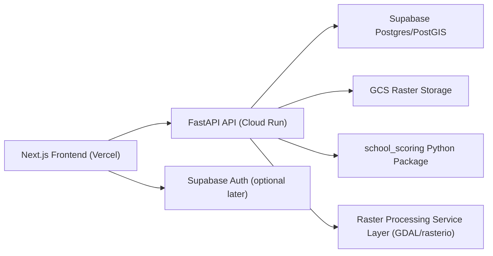

# RISE-PNG Dashboard Architecture

## Goal

Build a production-ready decision-support application for ADB staff to:
- visualize school locations and district context layers
- inspect school- and district-level indicators
- run and persist scoring scenarios
- generate a full ranked shortlist export

The notebook prototypes in [test_plot.ipynb](/Users/sonle/Documents/work/ADB/adb-school-optimize/test_plot.ipynb) and [score_calculations.ipynb](/Users/sonle/Documents/work/ADB/adb-school-optimize/score_calculations.ipynb) remain the methodological reference. The application should replace notebook-driven workflows with a structured web system.

## Agreed Product Decisions

- Frontend users: ADB staff only for v1
- Scenario persistence: required
- Ranked exports: full ranked list, not only filtered rows
- Selection model: single-select for map/table in v1
- School map default district: `National Capital District`
- School map default layer visibility: match the current defaults in [test_plot.ipynb](/Users/sonle/Documents/work/ADB/adb-school-optimize/test_plot.ipynb)
- District choropleth default indicator: `Average AQI`
- Runtime clipping: raster layers only
- Text joins: lowercase and collapsed whitespace
- Duplicate school names: not present across provinces/districts

## System Overview



## Why This Split

- `Next.js` gives better UI control than Streamlit and deploys cleanly on Vercel.
- `FastAPI` keeps scoring and geospatial processing in Python, matching the existing prototype assets and scoring logic.
- `Cloud Run` is a better fit than Vercel for GDAL/rasterio workloads and raster clipping.
- `Supabase/PostGIS` is the source of truth for vectors, indicators, scenarios, and ranked outputs.
- `GCS` stores original raster assets and supports runtime clipping pipelines.

## Repo Structure

```text
apps/
  web/                    Next.js application
services/
  api/                    FastAPI application
packages/
  school_scoring/         Deterministic scoring engine
infra/
  sql/                    DDL, views, seed scripts
  cloud-run/              Deployment config placeholders
  vercel/                 Frontend deployment placeholders
docs/
  architecture.md
datasets/
  ...                     Local ingestion/reference data
```

## Source Data Inventory

### School-level tabular source

- [png_curated_sec_schools_access_v3_clean.csv](/Users/sonle/Documents/work/ADB/adb-school-optimize/datasets/png_curated_sec_schools_access_v3_clean.csv)
  - business key: `School Name`
  - geometry source: `Latitude`, `Longitude`
  - contains school-level fields plus district/context indicators already attached

### Ranked output source

- [png_curated_sec_schools_ranked.csv](/Users/sonle/Documents/work/ADB/adb-school-optimize/datasets/png_curated_sec_schools_ranked.csv)
  - business key: `School Name`
  - derived output, not a raw source of truth

### District-level polygon source

- [aggregated_district_data.geojson](/Users/sonle/Documents/work/ADB/adb-school-optimize/datasets/aggregated_district_data.geojson)
  - business key: `Province` + `District`
  - geometry: district polygons
  - contains district indicators for the choropleth and context metrics

### Boundary layers

- [PNG_country.geojson](/Users/sonle/Documents/work/ADB/adb-school-optimize/datasets/PNG_country.geojson)
- [PNG_provinces.geojson](/Users/sonle/Documents/work/ADB/adb-school-optimize/datasets/PNG_provinces.geojson)
- [PNG_districts.geojson](/Users/sonle/Documents/work/ADB/adb-school-optimize/datasets/PNG_districts.geojson)

### Additional vector layers

- [air_quality.geojson](/Users/sonle/Documents/work/ADB/adb-school-optimize/datasets/air_quality.geojson)
  - joins by `NAM_1` / `NAM_2`
- [roads_intersect_2026_2.json](/Users/sonle/Documents/work/ADB/adb-school-optimize/datasets/roads_intersect_2026_2.json)
  - district-tagged road segments via `NAM_1` / `NAM_2`

### Access grid point layers

- [pop_access_walk_v2.csv](/Users/sonle/Documents/work/ADB/adb-school-optimize/datasets/pop_access_walk_v2.csv)
- [pop_no_walk_v2.csv](/Users/sonle/Documents/work/ADB/adb-school-optimize/datasets/pop_no_walk_v2.csv)
- [pop_access_drive_v2.csv](/Users/sonle/Documents/work/ADB/adb-school-optimize/datasets/pop_access_drive_v2.csv)
- [pop_no_drive_v2.csv](/Users/sonle/Documents/work/ADB/adb-school-optimize/datasets/pop_no_drive_v2.csv)
- [pop_access_cycle_v2.csv](/Users/sonle/Documents/work/ADB/adb-school-optimize/datasets/pop_access_cycle_v2.csv)
- [pop_no_cycle_v2.csv](/Users/sonle/Documents/work/ADB/adb-school-optimize/datasets/pop_no_cycle_v2.csv)
  - joins by `NAM_1` / `NAM_2`
  - rendered as point overlays, not runtime-clipped rasters

### Raster layers

- [PNG_flood_JRC.tif](/Users/sonle/Documents/work/ADB/adb-school-optimize/datasets/PNG_flood_JRC.tif)
- [Dynamic World LULC.tif](/Users/sonle/Documents/work/ADB/adb-school-optimize/datasets/Dynamic%20World%20LULC.tif)

## Canonical Data Model

The app should not use raw business keys as physical primary keys. It should store:
- surrogate IDs for internal relations
- normalized join keys for matching
- original names for display

### Core tables

`schools`
- one row per school
- `school_id` UUID primary key
- `school_name` display value
- `school_name_norm` normalized unique value
- `province`, `district`
- `geom` point in EPSG:4326
- school-level and context indicator fields

`districts`
- one row per district
- `district_id` UUID primary key
- `province`, `district`
- `province_norm`, `district_norm`
- `geom` polygon/multipolygon in EPSG:4326
- district indicators from aggregated district data

`school_scores`
- one row per school per scenario
- stores score outputs and rank order

`scoring_scenarios`
- persisted user-defined weight sets
- named scenarios for saved analysis

`layer_catalog`
- metadata for application layers, defaults, render behavior, and source assets

## Normalization Rules

All text joins use:
- `lower()`
- `trim()`
- whitespace collapsed to a single space

Current mapping rules:
- `School Name` -> school business key
- `Province` <-> `NAM_1`
- `District` <-> `NAM_2`

## CRS Rules

- Storage CRS for vector data: EPSG:4326
- Metric calculations: transform to EPSG:3857 or a more suitable projected CRS if later required
- Raster clipping: clip in source CRS, reproject output only when needed for the client

## Screen Architecture

### 1. School Explorer

Primary workflow:
- left map
- right table
- single selection shared between both

Features:
- default district `National Capital District`
- school popup/profile
- highlight selected table row when map point is selected
- district filter
- color schools by selected indicator or score
- toggle layers:
  - schools
  - roads
  - flood
  - land cover
  - air quality
  - internet/service indicators
  - access walk/drive/cycle point layers
- raster clipping only when district changes or map view requests a raster overlay

### 2. District Explorer

Features:
- district choropleth
- indicator switcher
- default indicator `Average AQI`
- optional school point overlay
- province/district hover details

### 3. Scoring Lab

Features:
- load default weights from the scoring package
- allow user overrides through form controls
- save named scenarios
- recompute ranking through API
- show component-level explainability for the selected school

### 4. Ranked Shortlist

Features:
- full ranked list
- rank by `Priority` then `Need`
- export CSV/XLSX
- reflect current selected scenario

### 5. Methodology

Features:
- describe sources
- list indicator groups
- explain score derivation and weight structure
- note preprocessing assumptions and caveats

## API Surface

### Metadata and filters

- `GET /api/v1/meta/layers`
- `GET /api/v1/meta/indicators`
- `GET /api/v1/meta/districts`
- `GET /api/v1/meta/provinces`

### School explorer

- `GET /api/v1/schools`
  - filters: district, province, indicator, scenario_id, selected_school_id
- `GET /api/v1/schools/{school_id}`
- `GET /api/v1/schools/{school_id}/explain`

### District explorer

- `GET /api/v1/districts`
- `GET /api/v1/districts/choropleth`
  - params: indicator, province, district

### Scoring

- `GET /api/v1/scenarios`
- `POST /api/v1/scenarios`
- `GET /api/v1/scenarios/{scenario_id}`
- `PATCH /api/v1/scenarios/{scenario_id}`
- `POST /api/v1/scoring/run`
  - body: scenario or weight overrides
- `GET /api/v1/scoring/latest`

### Exports

- `GET /api/v1/exports/ranked.csv`
- `GET /api/v1/exports/ranked.xlsx`

Exports should always return the full ranked list for the active scenario.

### Raster overlays

- `GET /api/v1/rasters/flood/overlay`
- `GET /api/v1/rasters/landcover/overlay`

Recommended params:
- `district`
- `province`
- `opacity`
- `palette`
- `width`
- `height`

The client should use these endpoints only for raster layers. Vector layers should come directly from database-backed API queries.

## Raster Processing Strategy

Backend responsibilities:
- fetch district geometry from PostGIS
- clip source raster from GCS using district geometry
- cache clipped artifacts where possible
- return map-ready PNG overlay or raster tile output

Caching approach:
- cache key should include layer name, district identifier, palette, and output dimensions
- store short-lived artifacts in Cloud Run temp storage or a cache bucket

## Layer Catalog for V1

The application should support all current layers in v1.

### Vector and point layers

- country boundary
- province boundaries
- district boundaries
- school points
- roads
- air quality polygons
- population within access points for walking
- population without access points for walking
- population within access points for cycling
- population without access points for cycling
- population within access points for driving
- population without access points for driving

### Raster layers

- flood inundation
- land cover

## Ingestion Pipeline

### Vector/tabular ingestion target

Supabase/PostGIS should store:
- schools
- districts
- boundaries
- roads
- air quality
- access point layers
- saved scenarios
- computed score outputs

### Raster ingestion target

GCS should store:
- source TIFs
- optional preprocessed overviews/pyramids

### Ingestion sequence

1. Normalize join keys from raw source files.
2. Load districts and boundaries.
3. Load schools and create point geometry from lat/lon.
4. Load auxiliary vector layers and access point layers.
5. Register raster assets in the layer catalog.
6. Run scoring package on school rows and persist the default scenario scores.

## Deployment Model

### Vercel

Host:
- `apps/web`

### Cloud Run

Host:
- `services/api`
- raster processing endpoints

### Supabase

Host:
- Postgres/PostGIS
- storage optional for small static assets

### GCS

Host:
- large source rasters and cached raster products

## Implementation Phases

### Phase 1

- create `school_scoring` package
- create core PostGIS schema
- build ingestion scripts for schools and districts
- stand up FastAPI with metadata, school, district, and scoring endpoints

### Phase 2

- implement Next.js school explorer
- implement district choropleth
- wire single-select sync between map and table

### Phase 3

- implement persisted scoring scenarios
- wire export endpoints
- add methodology page

### Phase 4

- implement runtime raster clipping and caching
- refine performance and styling
- prepare deployment to Vercel and Cloud Run

## Immediate Build Order

1. Implement the `school_scoring` package per [codex_school_scoring_module_instructions.md](/Users/sonle/Documents/work/ADB/adb-school-optimize/build_instructions/codex_school_scoring_module_instructions.md)
2. Create the PostGIS schema in [001_core_schema.sql](/Users/sonle/Documents/work/ADB/adb-school-optimize/infra/sql/001_core_schema.sql)
3. Add ingestion scripts for the current datasets
4. Stand up FastAPI endpoints
5. Scaffold the frontend around the school explorer first
